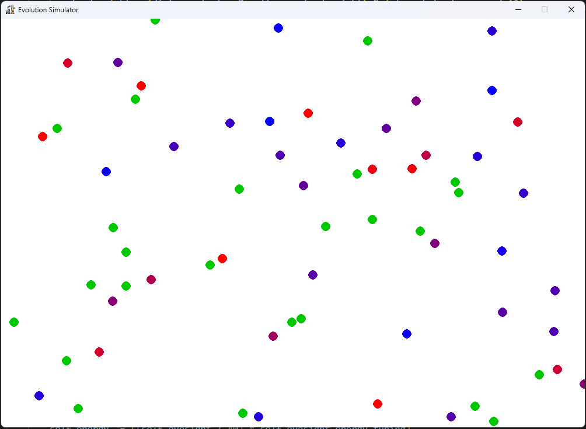

# A Simple Evolution Simulator.

This is a simple and expandable evolution simulator for experimenting with things.

## How to add your own content (Development)

---
### Main files

* entrypoint.py is simply the code that runs the game. Contstants contained there are simply just the amount of food that should spawn and the amount of creatures that should spawn.
* Game.py controls the rest of how the game runs. This also includes the split of types of food and creatures.

See [the docs](DOCS.md) for other development information.

---
### Screenshots

---
#### Attributions:
[Application icon by Freepik](https://www.freepik.com/icon/evolution_5930602)
